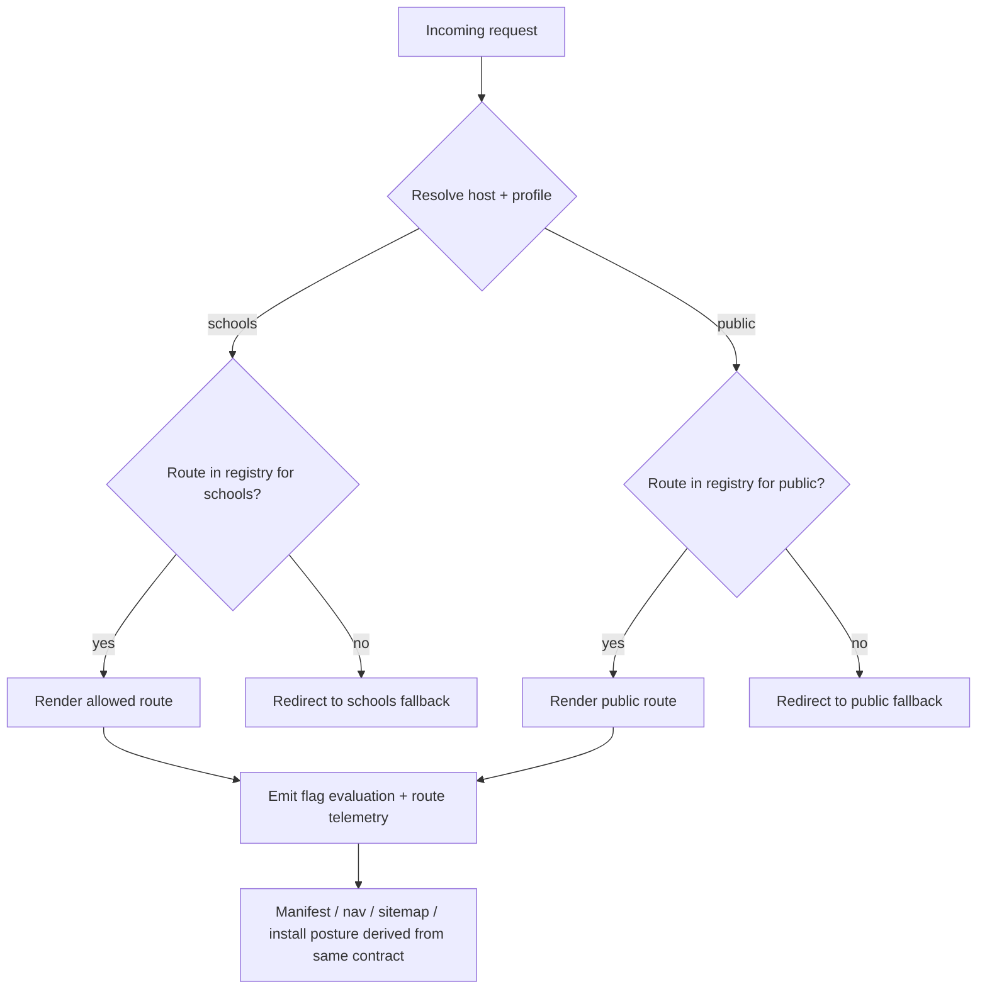

# Master deployment blueprint — BSS and blkck2

> **Status:** Reference / planning document. No code, CI, or deploy config is
> changed by landing this file. It captures the target architecture and a
> staged rollout so the individual pieces can be picked up as scoped follow-ups.
>
> **Scope note:** This session has access to `Blackcockatoo/bss` only. Claims
> about `Blackcockatoo/blkck` (the repository whose `CNAME` is `blkck2.com`)
> are carried from external review and are marked as such; they should be
> re-verified against that repo before acting on them.

## Verified against current `bss` code (2026-07-11)

The following claims in this blueprint were checked directly against the repo
at the time of writing and are accurate:

- `vercel.json` redirects `/` → `/metapet-landing.html` (temporary redirect),
  while `middleware.ts` redirects `/` → `/schools` when `APP_PROFILE === "schools"`.
  These two rules plus the Next home page at `/` are the "split-brain" the
  routing section describes.
- `middleware.ts` reads `NEXT_PUBLIC_CHILD_SAFE_BASELINE` and `APP_PROFILE`
  (from `src/lib/env/features.ts`) and delegates allow/fallback decisions to
  `src/lib/childSafeBaseline`.
- CI is a single combined job `quality` ("Lint, Test, Build") in
  `.github/workflows/ci.yml`, plus a separate `production-smoke-gate.yml`.
- Large non-code artefacts live in the repo root: `time-calculator-compass.zip`
  (~34 MB), `Teachers-Meta-Pet-Mr-Brand-main.zip`, `epic_addon_svgs.zip`,
  PDFs, DOCX files, and `.vercel-redeploy-*.txt` markers.
- `package.json`'s `build` runs `prepare:moss60-production` before `next build`,
  so release correctness already depends on a build-time asset step.

## Executive summary

The two public codebases are not at the same architectural maturity. `bss` is a
Next.js App Router application on modern dependencies, with middleware, a
profile-driven child-safe boundary, a lightweight service worker, dedicated CI,
and a separate smoke-gate workflow for school deployments. `blkck` (whose
`CNAME` is `blkck2.com`, whose Netlify config redirects to `https://blkck2.com`,
and whose root tree holds the deployed HTML, service worker, manifest, and
`i-ran-lego` import assets) is the live `blkck2.com` codebase.

The strongest reusable blueprint is not "make blkck2 behave like bss" or the
reverse. It is to extract a shared **deployment contract** with six modular
layers: a profile contract, a route-surface registry, a cache policy registry,
a deployment/domain contract, an asset import pipeline, and a release-quality
gate. Both repositories already hint at each layer, but the logic is fragmented.
In `bss`, profile logic is split between middleware, manifest generation, route
guards, tests, and smoke runbooks; in `blkck`, route aliases, domain redirects,
service worker behaviour, and ZIP import are spread across `_redirects`,
`netlify.toml`, `vercel.json`, `sw.js`, and a Python build script.

The most important near-term fixes are straightforward:

1. **Centralise routing and profile decisions** so landing pages, middleware
   redirects, manifest start URLs, navigation labels, and service-worker scope
   all read from one source of truth. Today `bss` has a Vercel root redirect to
   `/metapet-landing.html`, a Next home page at `/`, and a schools-mode
   middleware expectation that `/` redirects to `/schools` — a configuration
   split-brain.
2. **Replace manual cache naming and duplicated redirect rules** with generated
   manifests and a platform-neutral config layer.
3. **Stop treating ZIPs and large binaries as ad hoc repo-root artefacts** and
   move to an import manifest plus release-asset or Git LFS backed distribution.
4. **Separate lint, unit tests, build, and smoke verification** into independent
   CI jobs so failures are diagnosable and rollback decisions are obvious.

## Repository and platform baseline

`bss` is a Next.js 16.1.1 application using React 19.2.3, Vitest, ESLint, Biome,
Zustand, and `@vercel/analytics`. Its build script runs a Moss60 preparation
step before `next build`, so release correctness already depends on build-time
asset preparation. The repository includes source modules for app routes, school
docs, steering/navigation components, genome features, tests, PDFs, DOCX files,
ZIP archives, and Vercel redeploy text markers.

The public `blkck` repository is a static site rather than a framework app. Its
tree is dominated by HTML documents, media files, a `sw.js`, `_redirects`,
`netlify.toml`, `vercel.json`, and a Python build script that unpacks
`I_RAN_LEGO_LIVING_BOOK_v1.zip` into `/i-ran-lego`, patches the imported app,
inserts return links and purchase-enquiry paths, writes a local service worker
for the living-book artefact, updates the B$S portal content, validates expected
page counts and audio sizes, and deletes the source archive after build. Recent
Actions history shows repeated failures in `.github/workflows/import-i-ran-lego.yml`,
especially on `main` and several feature branches, which makes the import path
operationally brittle.

The best reading: `bss` already contains the seeds of a safe, profile-aware
application platform, while `blkck` is a content-forward static distribution
platform with bespoke import logic. So the right master blueprint is
**shared contracts, different runtimes**: the same profile, route, cache, asset,
and deploy schemas should drive both projects, but the adapters should remain
runtime-specific for Next.js and static Netlify/Vercel deployments. OpenFeature's
provider, evaluation-context, hooks, and event model fits the shared contract
layer because it supports domain-scoped providers, contextual evaluation,
lifecycle hooks, and provider readiness/error events without locking into one
vendor or storage backend.

### Candidate-approach comparison

| Area | Approach | Pros | Cons | Risk | Compatibility |
|---|---|---|---|---|---|
| Profile / access boundary | **Host-scoped builds** (e.g. `www.bluesnakestudios.com` public, dedicated schools domain) | Cleanest mental model; aligns with current `bss` smoke gate and `NEXT_PUBLIC_SITE_URL` contract; easy domain-specific manifests/metadata | Requires disciplined environment management and separate promotion paths | Low | High for both |
| Profile / access boundary | **Single build with route guards** | Fewer deployments; simpler hosting footprint | Metadata, manifest, and cache behaviour become ambiguous; special files can be cached; service workers stay shared | Medium | Medium for `bss`, weak for `blkck` |
| Cache invalidation | **Generated hashed precache / Workbox-style policy** | Strong invalidation; reduces manual version bumps | Slight tooling overhead | Low | High |
| Cache invalidation | **Manual cache version strings** (`meta-pet-shell-v2`, `moss-tree-v15`) | Simple; already in place | Easy to forget; drift between shell and static assets; more rollback pain | Medium | High |
| Asset distribution | **GitHub release assets + import manifest** | Large binaries up to 2 GiB each; controlled promotion; cleaner git history | Requires a release step | Low | High |
| Asset distribution | **Git LFS** | Better than normal git objects for large binaries; `.gitattributes` ships in archives | Ongoing storage/bandwidth management; not ideal for every deploy-time artefact | Medium | High |
| CI design | **Split jobs for lint, unit, build, smoke** | Clearer failures; faster feedback; easy required-check policy | Slightly more workflow authoring | Low | High |

## Routing and child-safe feature-flag blueprint

The current `bss` child-safe design has the correct primitives, but they are
over-coupled and spread across too many files. `NEXT_PUBLIC_CHILD_SAFE_BASELINE`
and `NEXT_PUBLIC_APP_PROFILE` are read in `src/lib/env/features.ts`, where
enabling the child-safe baseline can implicitly force the whole app into the
`schools` profile. Middleware then redirects `/` to `/schools` in schools mode
and sends blocked routes to a fallback path, while server and client route
guards enforce the same policy inside pages. Tests confirm schools mode blocks
`/app`, `/compass`, `/pet`, `/identity`, and `/genome-resonance`, while allowing
`/schools`, `/school-game`, `/legal/privacy`, and school docs.

The root cause of routing fragility: **policy and presentation are not reading
from the same registry.** The steering wheel still publishes consumer routes
such as `Shop`, `Digital DNA`, `Identity`, `Genome Resonance`, `Lineage`, and
`QR Messaging`, while schools mode blocks many of those and the activities page
hides the navigator entirely when `IS_SCHOOLS_PROFILE` is true. Meanwhile
`/compass` is a redirect to `/app/activities`, yet the root landing page still
advertises "Open Navigator". That points to a route-surface mismatch, not a
single broken component.

The concrete component here is a **Route Surface Registry** plus a **Profile
Contract**:

```ts
// app-contract.ts
export type AppProfile = "public" | "schools";

export type RouteIntent =
  | "landing"
  | "navigator"
  | "classroom"
  | "document"
  | "consumer"
  | "admin";

export interface RouteRule {
  path: string;
  intent: RouteIntent;
  profiles: AppProfile[];
  navLabel?: string;
  discoverable?: boolean;
  fallbackByProfile?: Partial<Record<AppProfile, string>>;
  installVisible?: boolean;
}

export interface ProfileContract {
  profile: AppProfile;
  domain: string;
  startUrl: string;
  manifestName: string;
  allowInstall: boolean;
  childSafeBoundary: boolean;
}
```

That contract becomes the source for middleware matching, navigation rendering,
manifest generation, landing-page CTAs, sitemap inclusion, school smoke tests,
and service-worker navigation fallbacks. The current `bss` test suite already
shows the policy you want; the missing step is to make it declarative and
shared. OpenFeature can sit one layer above the registry so route visibility,
install posture, adult-only tools, and experiments are evaluated against a
formal context such as `{ profile, host, audience, routeIntent }`, with hooks
logging every non-default evaluation.



**Integration steps.** Create a single `contracts/routes.ts` in `bss`, then
adapt middleware, `manifest.ts`, landing pages, and steering navigation to
consume it. In `blkck`, compile the same registry into `_redirects`,
`netlify.toml`, and the generated studio sections file so alias paths, public
pages, and school/professional views are produced from one source.

**Automated tests.** Assert that: every discoverable route exists in the
registry; every schools-allowed route is excluded from consumer-only navigation;
every manifest start URL exists in the route registry; every redirect target is
a declared route; and every host-profile pair resolves to exactly one landing
route. Keep current `childSafeBaseline` and middleware tests, but generate most
assertions from the registry.

**Rollout and rollback.** Implement first in `bss` behind a `route_contract_v1`
flag, then compile static outputs for `blkck`. Rollback is easy: keep existing
middleware and `_redirects` generated side-by-side until parity is proven.
Effort: **M** for `bss`, **M** for `blkck`, **L** to make contracts reusable.

**Monitoring.** Emit events for "blocked route attempted", "fallback redirect
executed", "navigator target missing", and "manifest/profile mismatch". Alert if
a schools host serves a manifest whose `start_url` is not `/schools`, or if a
non-discoverable page appears in nav or sitemap.

## Service-worker, cache invalidation, and deployment blueprint

`bss` and `blkck` have opposite service-worker strategies. `bss` keeps its
worker narrow: it precaches only manifest and icon files, refuses to cache page
navigations or `/_next` assets, deletes old caches on activation, and forces
one-time reloads of open tabs so stale loader shells do not pin users to
mismatched JavaScript chunks. `blkck` uses a manually versioned cache name,
preloads a large application shell (many HTML pages, documents, icons,
downloads), serves navigations network-first with a cached `index.html`
fallback, serves shell items network-first, serves other small assets
stale-while-revalidate, and leaves video network-only.

Neither is ideal as a shared blueprint. Browser and Workbox guidance both
recommend separating navigation handling from asset handling, using
network-aware strategies for HTML, considering navigation preload, and
versioning/hashing static assets so stale runtime caches do not hold old
resources. Workbox also documents the "deploy a no-op service worker" recovery
pattern — the cleanest emergency rollback to build into both projects.

The right component is a **Cache Policy Registry**:

```ts
export type CacheStrategy =
  | "network-only"
  | "network-first"
  | "stale-while-revalidate"
  | "precache";

export interface CacheRule {
  match: string;
  strategy: CacheStrategy;
  cacheName?: string;
  maxAgeSeconds?: number;
  scope: "navigation" | "shell" | "asset" | "media" | "doc";
  rollbackSafe?: boolean;
}

export interface CacheContract {
  version: string;          // derived from commit SHA or build ID
  rules: CacheRule[];
  emergencyNoop?: boolean;  // kill switch
}
```

For `bss`, generate the cache contract from the Next build ID, keep navigations
network-first or network-only, never cache `/_next` chunks in the custom worker,
and treat `manifest.webmanifest` carefully because Next metadata routes are
cached by default unless made dynamic. For `blkck`, replace hand-maintained
`APP_SHELL` arrays with a generated manifest and split documents from HTML pages
so PDF/poster additions cannot silently bloat the offline shell.

Deployment-wise, both repos run on overlapping hosting assumptions. `bss` uses
Vercel config with `framework: "nextjs"`, `buildCommand: "npm run build"`, a
root redirect in `vercel.json`, and derives site URLs from `NEXT_PUBLIC_SITE_URL`,
`VERCEL_PROJECT_PRODUCTION_URL`, and `VERCEL_URL`. `blkck` carries both Netlify
and Vercel configs, but Netlify is the stronger canonical contract because it
owns redirects, headers, security headers, HTML/service-worker cache control,
and canonicalisation to `https://blkck2.com`; Vercel is only told to run the
Python build and publish `.`.

Define a **single logical deploy contract** and compile it per platform:

```json
{
  "canonicalHost": "blkck2.com",
  "aliases": ["www.blkck2.com"],
  "enforceHttps": true,
  "landingByHost": {
    "www.bluesnakestudios.com": "/",
    "schools.bluesnakestudios.com": "/schools"
  },
  "headers": {
    "html": "public, max-age=0, must-revalidate",
    "serviceWorker": "public, max-age=0, must-revalidate",
    "static": "public, max-age=31536000, immutable"
  }
}
```

Compile that to `vercel.json`, `next.config.js` redirects/headers where
appropriate, `netlify.toml`, and `_redirects`. Netlify allows redirects and
headers in either `_redirects` or `netlify.toml`; `blkck` currently duplicates
domain rules in both, increasing drift risk. Use Vercel's production-domain
environment variable for stable canonical URL generation instead of
hand-maintaining separate root redirects and host logic.

**Integration steps.** Introduce a `deploy.contract.json`, generate
platform-specific files during CI, and make those generated files the only
editable deployment outputs. Add an emergency `noop-sw.js` artefact and release
process so a bad worker can be neutralised quickly.

**Automated tests.** Snapshot the compiled redirects and headers; smoke-test
canonical host, `www`→apex, `http`→`https`, manifest start URL, and
service-worker cache headers; and add one deploy-time test confirming `/_next`
assets are not intercepted by the custom worker on `bss`. Use existing
`site-health.html` patterns in `blkck` as the seed.

**Rollout and rollback.** Roll out generated configs first in preview/staging,
then production. Keep old static config files committed for one release as
backup. Rollback: redeploy prior commit plus no-op worker if cache-related.
Effort: **M**.

**Monitoring.** Alert on a rise in worker-controlled loads with stale build IDs,
non-zero redirect-loop rates, cache-miss spikes on shell files, and
manifest/profile mismatches. If you adopt navigation preload for network-first
HTML, monitor navigation TTFB and fallback frequency before and after.

## Asset import and package workflow blueprint

The biggest operational weakness in `blkck` is the living-book import path. The
pipeline expects a repo-root ZIP named `I_RAN_LEGO_LIVING_BOOK_v1.zip`, rejects
it if unexpectedly small, unpacks it, verifies a fixed set of required files,
verifies page count and audio size, copies it into `/i-ran-lego`, rewrites
content, writes a service worker, patches portal navigation, validates again,
then deletes the archive. Clever, but a **magic-file build pipeline**. It is
fragile across deploy paths, and Netlify manual deploys without continuous
deployment do not run a build command at all — so drag-and-drop or ZIP-based
Netlify deploys can skip the import step entirely.

Both repos keep sizeable non-code artefacts in git history (`bss`: PDFs, DOCX,
ZIPs, redeploy markers; `blkck`: ZIPs and MP4s in the root). GitHub guidance
points large binary distribution toward releases or Git LFS; release assets
support very large files while staying outside normal Git object history.

The modular fix is an **Asset Import Manifest** plus a **resolver** that can
fetch from local files, GitHub releases, or LFS-backed paths:

```ts
export interface AssetSource {
  id: string;
  kind: "repo" | "release" | "lfs";
  uri: string;
  sha256: string;
  bytes: number;
}

export interface ImportPackage {
  packageId: string;
  version: string;
  targetPath: string;
  source: AssetSource;
  requiredFiles: string[];
  validators: {
    minPages?: number;
    minAudioBytes?: number;
  };
  patchSteps: string[];
}
```

For `blkck`, the living-book importer should consume this manifest rather than
hard-coding one ZIP filename. For `bss`, the same system can govern school
handout bundles, Moss60 static exports, or printable packs. Imports become
reviewable "content releases" with checksums and version identifiers instead of
silent repo-root replacements.

**Integration steps.** Move `I_RAN_LEGO_LIVING_BOOK_v1.zip` out of normal source
control into GitHub Releases or Git LFS, commit an import manifest, and update
`prepare-i-ran-lego.py` (or its replacement) to read the manifest. Add a CI job
that validates asset presence and checksum before any deploy build proceeds. A
content-package change bumps the manifest version, which can auto-bump cache
scope for the imported app.

**Automated tests.** Unit-test every validator; integration-test one happy-path
import and one corrupt-archive path; add a dry-run mode that verifies required
files without writing output. Test the "build command absent" case for Netlify
manual deploys by failing loudly when imported content is missing.

**Rollout and rollback.** Publish asset releases while leaving repo-root
references alive, then flip the resolver. Rollback: switch the manifest back to
the previous asset version. Effort: **M** for the import system, **S** to move
individual artefacts.

**Monitoring.** Emit "import started", "import validated", "import checksum
mismatch", and "import skipped due to unsupported deploy mode". Alert if the
deployed site serves a stale package version versus the manifest version the
build expects — this catches the current class of import-workflow failures far
earlier.

## Discoverability and navigation blueprint

Discoverability issues here are structural, not cosmetic. In `bss`, the static
landing page promotes "Open Navigator", but `/compass` redirects to
`/app/activities`, and the activities page hides the navigator when the schools
profile is active. The steering wheel exposes twelve conceptual destinations,
but the rendered compass ring filters out `Genome Resonance` — hidden logic and
visible layout already diverge.

Mobile labelling has already been worked on in isolation: `labelUtils.ts` splits
long labels across lines on compact viewports, and network/geometry views
compute text scaling, plate widths, line heights, and compact-screen layout. So
the missing blueprint is not "responsive labels" — it is **discoverability
governance**: which routes appear where, under which profile, with what entry
affordance, and with what fallback language when a route is disabled or hidden.

The reusable component is a **Navigation Surface Registry** layered on the route
registry:

```ts
export interface NavSurfaceEntry {
  route: string;
  label: string;
  shortLabel?: string;
  surface: "landing-cta" | "bottom-nav" | "wheel" | "school-docs" | "site-map";
  profiles: ("public" | "schools")[];
  priority: number;
  hiddenReason?: "blocked" | "beta" | "deprecated";
  mobileLabelPolicy?: "single-line" | "split" | "icon-only";
}
```

One place decides that `Navigator` is visible on the public landing page but not
on schools builds; that school routes use plain-language labels rather than
lore-heavy copy; and that deprecated routes such as `/compass` can remain as
aliases while the visible label points to `/app/activities` or its successor. It
also bridges `blkck`, where discoverability is currently a mix of index-page
sections, `_redirects` aliases, PWA shortcuts, and manual "site health" links.

**Integration steps.** Replace hard-coded landing CTAs and wheel-target arrays
with generated entries. In `blkck`, generate PWA shortcuts and friendly aliases
from the same registry. In `bss`, add route deprecation metadata so `/compass`
issues a measured redirect with analytics rather than silently acting as an
alternate path forever.

**Automated tests.** A "discoverability parity" suite: every visible CTA maps to
an existing route; every wheel route exists in the registry; every school nav
item is allowed by the child-safe boundary; compact labels render within width
constraints; deprecated aliases still land on the intended canonical target.

**Rollout and rollback.** Instrument current surfaces first without changing
them, then switch one surface at a time (landing CTAs, bottom nav, wheel, school
docs, PWA shortcuts). Rollback is surface-specific. Effort: **S**–**M**.

**Monitoring.** Track CTA click-through, nav-route 404 rate, redirects from
deprecated aliases, compact-label overflow incidents, and the ratio of
blocked-route attempts from first-party UI. Blocked attempts via direct URL are
acceptable; a rise in blocked attempts after a UI release means discoverability
regressed.

## Quality gates and access-control blueprint

`bss` CI is functional but compressed: `ci.yml` runs checkout, Node setup,
`npm ci`, lint, tests, child-safe deployment assertion, and build in one
`quality` job. A second workflow, `production-smoke-gate.yml`, requires manual
confirmation and a smoke owner, reruns lint/build/deployment assertions, and
checks a runbook whose pass criteria include schools-domain routing,
blocked-route enforcement, school-safe manifests, classroom runtime health, and
privacy-page behaviour. Strong in spirit, but because lint/test/assert/build are
not split, diagnosis is slower than it needs to be.

`blkck` shows the opposite problem: Actions history exposes repeated failures for
`import-i-ran-lego.yml`, but the tree does not publicly expose a stable,
source-visible test and quality-gate structure. The asset-import path is
operationally important but not yet a transparent contract in the repo.

Standardise on four quality layers:

```yaml
name: quality
on: [push, pull_request]

jobs:
  lint:
    runs-on: ubuntu-latest
    steps: [ ... ]

  unit:
    runs-on: ubuntu-latest
    steps: [ ... ]

  build:
    runs-on: ubuntu-latest
    needs: [lint, unit]
    steps: [ ... ]

  smoke-contract:
    if: github.ref == 'refs/heads/main'
    needs: [build]
    steps: [ ... generated contract checks ... ]
```

For access control, the correct default is **separate public and schools
surfaces, not hidden consumer features on one shared public host.** `bss` already
encodes that direction via schools-specific route guards, a deployment assertion
requiring a dedicated schools domain, and a manual smoke runbook. `blkck` does no
access control; its `/schools` and `/professional` routes are public redirects to
`gov.html` — content segmentation, not boundary enforcement. So treat `blkck`
school/professional pages as public content and reserve true access control for
school-only or adult-only tools on dedicated hosts or authenticated paths. Where
static edge protection is needed, Netlify role-based redirects are a
platform-specific option; on the Next side, request-time route control belongs in
middleware, not client-only hiding.

**Integration steps.** Split the `bss` CI pipeline into independent required
checks; add contract-based route and manifest verification; create a `blkck`
import-validator workflow that checks asset-manifest integrity before deploy.
Define three surface classes in the shared contract: `public`, `school-reviewed`,
`restricted`. Only `restricted` surfaces require explicit host or auth checks.

**Automated tests.** Required checks: route-boundary, manifest-domain, domain
redirect, import checksum, service-worker policy snapshots, and one
Playwright-style smoke suite for the school host. Keep manual smoke signoff, but
only after automated smoke passes.

**Rollout and rollback.** Split CI first (it improves safety for every later
change), then roll access-boundary changes host by host. Checks are additive;
the main rollback need is keeping only one contract file authoritative at a time.
Effort: **S** for the `bss` CI split, **M** for `blkck` import validation, **M**
for shared access classes.

**Monitoring.** Alert on failed import validation, school-host route escapes,
school-host manifest mismatches, and blocked-route attempts from first-party UI.
For restricted surfaces, track unauthorised attempts separately from normal 404s.

## Rollout plan

Stabilise contracts before surfaces, then CI before cache rewrites, then asset
movement before domain hardening, and only then full promotion. That sequence
minimises "fixed by deploy, broken by cache" regressions and gives a clean
rollback point at every stage. It lines up with `bss` (its smoke runbook already
assumes a dedicated schools deployment and contract-driven checks) and with
`blkck` (where import and redirect drift are the biggest reliability risks).

```mermaid
flowchart LR
    A[Define shared contracts] --> B[Split CI and add contract tests]
    B --> C[Adopt route and nav registries in bss]
    C --> D[Generate redirects and headers for blkck]
    D --> E[Move large artefacts to release assets or LFS]
    E --> F[Generate cache policies and add no-op SW rollback]
    F --> G[Run schools smoke gate and static site health checks]
    G --> H[Promote to production]
    H --> I[Observe metrics and keep previous manifest/config for rollback]
```



**Effort view.**

- **Small:** split `bss` CI jobs; add contract snapshots; deprecate `/compass`
  cleanly; add route-surface telemetry.
- **Medium:** build the shared route/profile/navigation contracts; generate
  platform-specific redirects and headers; move `blkck` import to a
  manifest-based resolver; formalise service-worker policies.
- **Large:** unify both repos around one internal package for contracts,
  generators, and telemetry hooks — a single reusable package consumed by both
  Next.js and static build tooling.

The headline recommendation: treat **routing, cache, deploy, assets,
discoverability, and access** as one cause-and-effect system. Each repository has
parts of that system but no shared backbone. Build the backbone first, and most
of the "obvious fixes" become generated outputs rather than recurring manual
clean-up.
