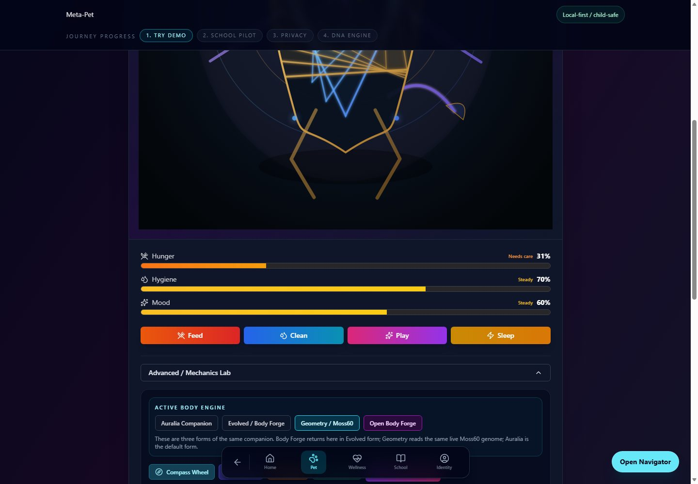
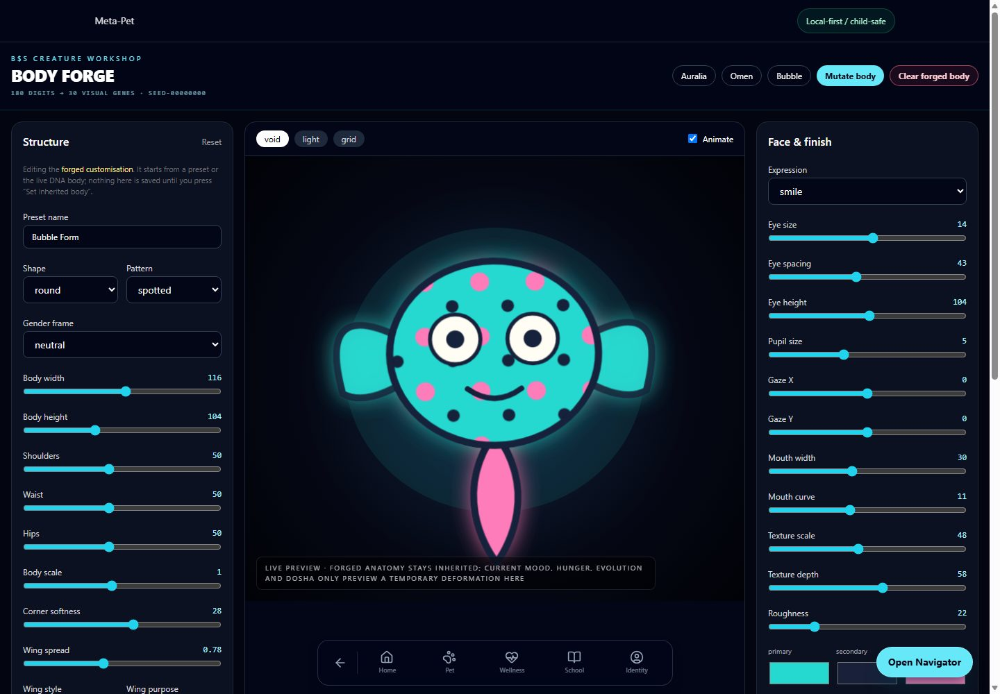
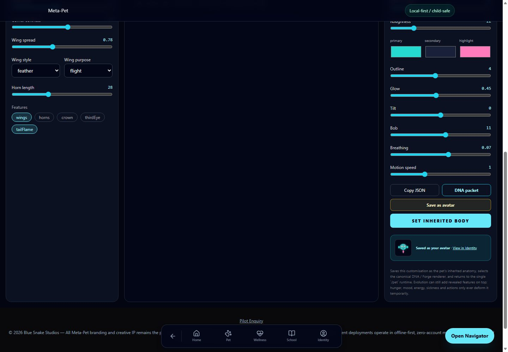
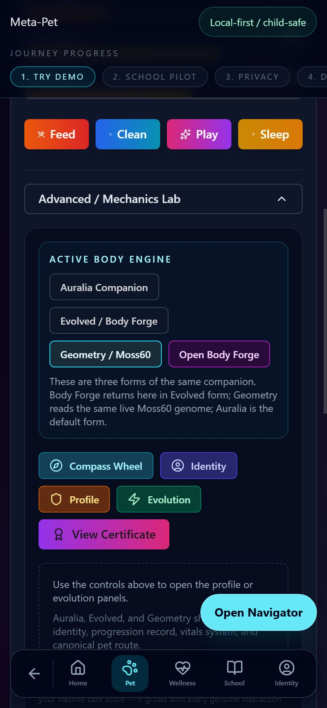
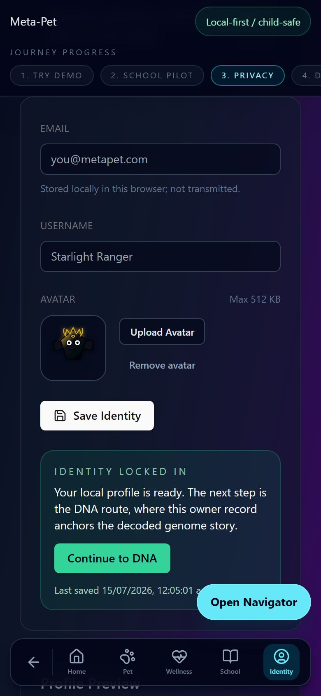

# PR #151 release validation

Validated 15 July 2026 (AEST) against the production build from the PR branch.

## Locked environment

- Node 22.23.1
- npm 10.9.2 with the committed `package-lock.json`
- Next.js 16.1.6
- Vitest 4.0.16

## Automated checks

- `npm run lint` — passed
- `npm test -- --run` — 91 files and 662 tests passed
- `npm run build` — passed; 84 static pages generated
- `git diff --check` — passed

The suite includes the legacy form migrations, the versioned Body Forge packet and update event, the pure-DNA fallback, one-authoritative-renderer behavior, and avatar validation/replacement coverage.

## Desktop and phone smoke test

The Node 22 production build was tested in a clean, extension-free Edge profile at 1440×1000 and 390×844.

- Auralia, Evolved / Body Forge, and Geometry / Moss60 each mounted exactly one authoritative renderer.
- Switching forms left the displayed vitals, progression values, Identity packet, and forged-body packet unchanged.
- Saving `Bubble Form` returned to `/pet` in Evolved form and wrote `bss:meta-pet:body-spec:v2` with `version: 2`.
- After a hard reload, Body Forge restored `Bubble Form`. Clearing it removed the packet and a fresh Body Forge load returned to the default DNA body.
- Geometry rendered at phone width with no horizontal page overflow.
- Body Forge saved a PNG Identity avatar, displayed its thumbnail, required confirmation before replacement, and persisted the replacement across `/identity` reloads.
- No React, hydration, or application runtime errors remained. The expected missing local Vercel Analytics endpoint was excluded from the local-only console check.

## Screenshots

