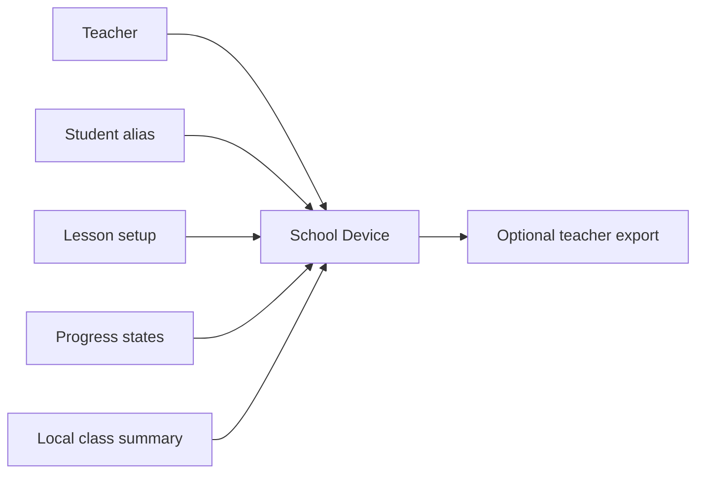

# MetaPet Schools Data Flow Diagram

## Default classroom flow

## Notes

- Default classroom use stays on the current device.
- The teacher controls setup, lesson timing, and any export.
- Export is optional and should be reviewed before leaving the device.
- Adult-only and experimental routes sit outside this school flow.
