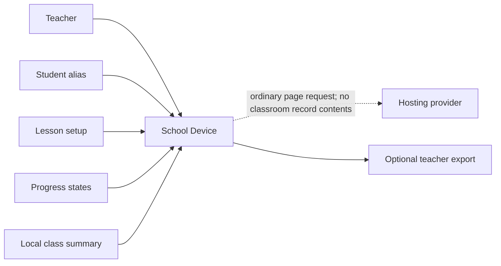

# MetaPet Schools Data Flow Diagram

## Default classroom flow

```mermaid
flowchart LR
  T["Teacher"] --> D["School Device"]
  S["Student alias"] --> D
  L["Lesson setup"] --> D
  P["Progress states"] --> D
  A["Local class summary"] --> D
  D -. "ordinary page request; no classroom record contents" .-> H["Hosting provider"]
  D --> X["Optional teacher export"]
```

## Notes

- Classroom record contents stay on the current device during routine use.
- The hosting provider receives ordinary page requests; those routine requests do not include the classroom record contents.
- The teacher controls setup, lesson timing, and any export.
- Export is optional and should be reviewed before leaving the device.
- Adult-only and experimental routes sit outside this school flow.
